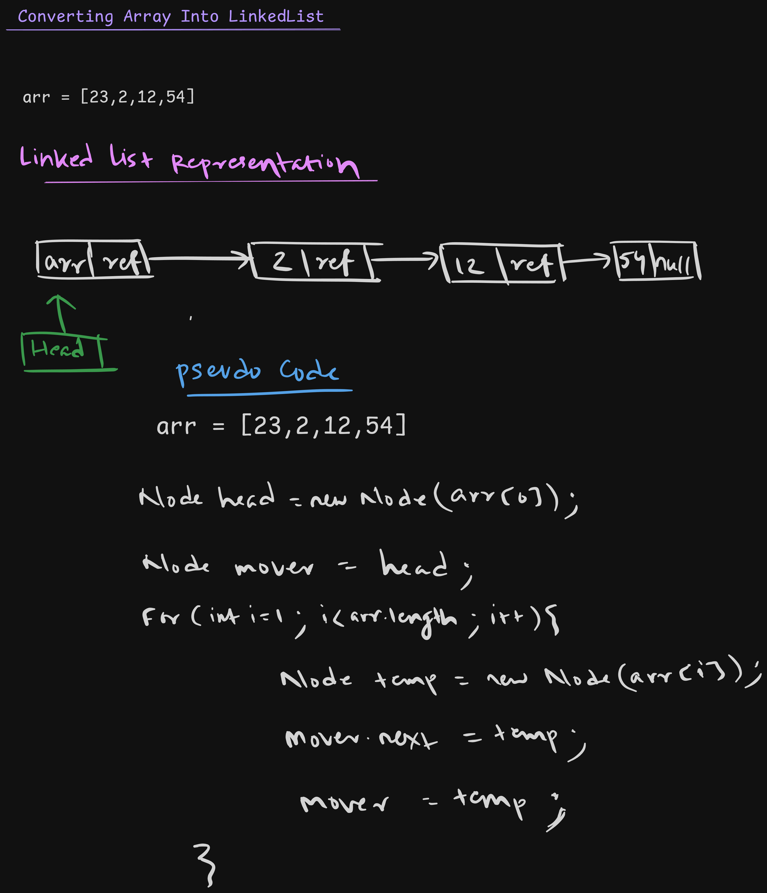

## Node Class
```java
public class Node {
    public int data;
    public Node next;

    public Node(int data){
        this.data = data;
        this.next = null;
    }
}
```

## Converting Into Linked List
```java
package LinkedList;

public class LinkedList {

    public static Node convertArrayIntoLinkedList(int[] arr){
        if(arr == null || arr.length == 0) return null;

        Node head = new Node(arr[0]);
        Node mover = head;

        for(int i = 1; i < arr.length; i++){
            Node temp = new Node(arr[i]);
            mover.next = temp;
            mover = temp;
        }
        return head;
    }

    public static void traverse(Node head){
        Node current = head;
        while (current != null){
            System.out.println(current.data);
            current = current.next;
        }
    }
}
```

```java
Node head = LinkedList.convertArrayIntoLinkedList(new int[]{12, 23, 45});
LinkedList.traverse(head);
```