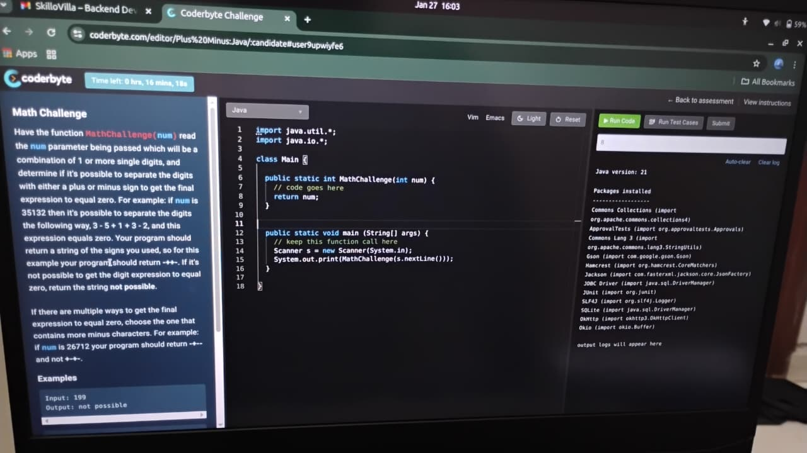

### **Math Challenge**

Have the function `MathChallenge(num)` read the `num` parameter being passed which will be a combination of 1 or more single digits, and determine if it's possible to separate the digits with either a plus or minus sign to get the final expression to equal zero.

**Example:** If `num` is **35132**, then it's possible to separate the digits the following way: `3 - 5 + 1 + 3 - 2` This expression equals zero.

- **Goal:** Your program should return a string of the signs you used.
    
- **Result:** For the example above, your program should return `-++-`.
    
- **Failure Case:** If it's not possible to get the digit expression to equal zero, return the string `not possible`.
    

**Tie-Breaker Rule:** If there are multiple ways to get the final expression to equal zero, **choose the one that contains more minus characters.**

- _Example:_ If `num` is **26712**, your program should return `-+--` instead of `+-+-`.
    

**Examples shown:**

- **Input:** 199
    
- **Output:** not possible
    
- **Input:** 35132
    
- **Output:** -++-
---
## Strategy

1. Convert number to digit array
    
2. Try all combinations of `+` and `-`
    
3. Track:
    
    - Current sum
        
    - Sign string
        
4. When sum == 0:
    
    - Save result
        
    - Apply **tie-breaker** (more `-`)
        
5. Return best result or `"not possible"`
## Tie-Breaker Rule

If multiple valid answers exist:

- Count number of `-`
    
- Choose the one with **maximum `-`**
---
```java
public class MathChallenge {

    static String bestResult = null;
    static int maxMinusCount = -1;

    public static String MathChallenge(String num) {
        int[] digits = new int[num.length()];
        for (int i = 0; i < num.length(); i++) {
            digits[i] = num.charAt(i) - '0';
        }

        backtrack(digits, 1, digits[0], "", 0);

        return bestResult == null ? "not possible" : bestResult;
    }

    private static void backtrack(int[] digits, int index, int sum,
                                  String path, int minusCount) {

        if (index == digits.length) {
            if (sum == 0) {
                if (minusCount > maxMinusCount) {
                    maxMinusCount = minusCount;
                    bestResult = path;
                }
            }
            return;
        }

        // Try '+'
        backtrack(
            digits,
            index + 1,
            sum + digits[index],
            path + "+",
            minusCount
        );

        // Try '-'
        backtrack(
            digits,
            index + 1,
            sum - digits[index],
            path + "-",
            minusCount + 1
        );
    }

    // For testing
    public static void main(String[] args) {
        System.out.println(MathChallenge("35132")); // -++-
        System.out.println(MathChallenge("199"));   // not possible
        System.out.println(MathChallenge("26712")); // -+--
    }
}
```